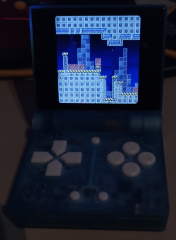

# Blockdude Funkey-s Version
   

   
  

Blockdude is a puzzle game where you need to be able to reach the exit by moving boxes. 
It is a remake of the Blockman Game from Soleau Software and the TI 83 Blockdude game by brandon sterner. 

## funkey Game Features:
- 23 levels included. 21 Levels from the orginal blockman game and 2 levels created by me. 
- build in level editor so you can create new levels on your own and release them as level packs. 
- Skin support! with a few skins preinstalled
- Auto saves progress

## Playing the Game:
Blockdude Will start up at the main menu, here you can choose the level pack you wish to edit or play by using left an right when the level pack name is selected (it's between "<>" signs). 
When a level pack is loaded either for game play or level editing, the level selector will show up. Here you select what level you wish to edit or play (if it's been unlocked yet). 
After you solved a level one extra level will be unlocked. you always have to solve to last unlocked level in order to unlock the next one.

## Controls

| Button | Action |
| ------ | ------ |
| Dpad | Select menu's. During gameplay move player left right or jump on boxes |
| A | Confirm in menu's. During gameplay jump on blocks and ledges, place a part in the level editor |
| B | During gameplay pickup / drop boxes |
| Y | In Level editor Mode, Create a new level when being in the level selector. In the level editor itself erase all parts from the screen |
| Y + Dpad | When playing a level you can look around in the level |
| X | Hide the part position/grid in the level editor |
| SELECT | Quit to title screen on the level selector, Quit to level selector in game and level editor mode. Quit the game on the title screen |
| L | At the level Selector decrease selected level with 5, During game play select the next Skin. In the level editor select previous part |
| R | At the level Selector increase selected level with 5, In the level editor select next part |
| Start Button | Test level when being in the level editor, go back to level editor after testing, Restart the current level |
| Menu button | Quit Game |

## Level Packs
if you wish to create levels yourself, load up the level editor and create a new level pack. 
you choose a name by using up down left right and confirm the name by using A.
There is a space sign included decrease the selected sign to go to it.
Once a new level pack has been created you can then load it, and you will be in the level selector.
just press Y and start creating your own levels.
The level editor will know when a level has been changed, so it will ask you, if you want to save whenever you quit back to the level selector (using select).
The level editor will also automatically choose a filename for the levels, you don't need to worry about this.
Once your level pack is finished you can just zip your level pack directory and release it to the public. It is located in the home directory
Other people will then have to unzip your level pack in the level packs in the level pack directory from the home directory and it will be shown inside the game.

## Credits
- Blockdude GP2X Is created by Willems Davy Aka Joyrider - Willems Soft 2006-2024
- Music is created by donskeeto !
- The Blockman levels are created by Soleau Software - Http://www.soleau.com
- The default graphics skin was created by Chris Katiesen for Klas Kroon's remake of blockdude/Blockman. - http://oos.moxiecode.com
- Blockdude for the TI-83 was created by Brandon Sterner
- FP_Tech skin and FP_Default2 is created by fusion power!
